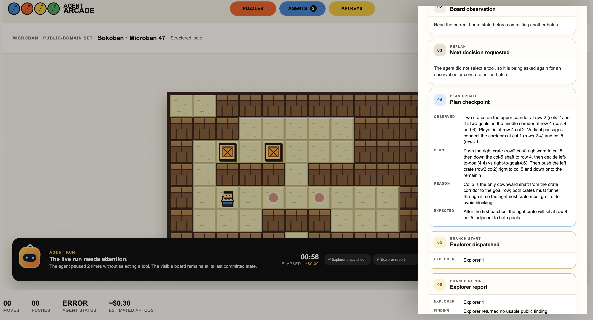

# Agent Arcade

**An inspectable playground where AI agents solve logic and visual puzzles.**

[Live demo](https://agentarcade.onrender.com) · [Devpost project](https://devpost.com/software/agent-arcade) · [Technical report](AGENT_ARCADE_REPORT.md)



Agent Arcade turns puzzles into small, controlled environments for watching an agent work. Instead of showing only a final answer, it renders the puzzle board, validates each action, and records a concise public journal of observations, plans, explorer branches, helper work, action batches, token use, and estimated cost.

## What it includes

- **Logic worlds:** Sokoban, maze, and Klotski with explicit, rule-validated actions.
- **Visual worlds:** real-image Jigsaw puzzles that require visible fragment matching.
- **Computer-control worlds:** cursor-driven Klotski and Jigsaw variants that accept literal validated drags on a virtual screen.
- **Inspectable live runs:** a model can observe, make a short public plan, create focused explorer branches, write/run a restricted Python helper, commit actions, and re-observe the result.
- **Bring your own key:** visitors use their own OpenAI or Anthropic key; public deployments do not contain an author key or store visitor keys.

## Quick start

### Requirements

- Node.js **20–24**
- An Anthropic API key for live Claude puzzle runs; an OpenAI key may also be used for provider connection checks.

### Run locally

```bash
git clone https://github.com/Gaurav17Joshi/AgentArcade.git
cd AgentArcade
npm install
cp .env.example .env.local
```

Open `.env.local` in a local editor and add only the keys you intend to use:

```bash
ANTHROPIC_API_KEY=your_anthropic_key
OPENAI_API_KEY=your_openai_key
```

Then start the app:

```bash
npm start
```

Open [http://127.0.0.1:4173](http://127.0.0.1:4173). If that port is busy, run `PORT=4174 npm start` instead. Never commit `.env.local` or paste a key into chat.

### Run a live agent

1. Choose a puzzle and level from **Puzzles**.
2. Open **API keys** and add a personal key for the current browser tab, or use your local `.env.local` setup.
3. Open **Agents**, choose a provider/model and run mode, then start the agent.
4. Watch the live board and open **View trace** to inspect the complete public journal. Explorer branches appear in the Agents panel.

The hosted app at [agentarcade.onrender.com](https://agentarcade.onrender.com) uses browser-session BYOK mode. A user key is sent only for that provider request, is not saved by Agent Arcade, and is cleared when the page reloads.

## How the agent loop works

Every environment exposes a current observation, a restricted action surface, an action validator, a solved-state check, and a renderer. The runtime follows this loop:

```text
observe → publish a concise public checkpoint → optionally explore or use a helper
       → propose a short action batch → validate → animate → observe again
```

Logic puzzles use structured moves. Visual cursor puzzles render a virtual screen and accept only valid mouse drags against its coordinates. The journal is deliberately a human-readable public trace, not hidden chain-of-thought. Boards update while the agent works and are marked solved only after the environment's actual solved-state check passes.

Small Python helpers may be written in an isolated temporary workspace for calculations such as search or board verification. The restricted runner has short CPU/memory limits and no filesystem, shell, browser, network, environment-variable, or API-key access.

## Built with Codex and GPT-5.6

Agent Arcade was built end-to-end with **Codex**. Most implementation happened in a single Codex session using **GPT-5.6 Terra at Extra High reasoning**.

Codex accelerated the project from the initial product sketch through:

- designing the puzzle-environment and agent-loop contract;
- implementing the vanilla HTML/CSS/JavaScript interface and Node streaming server;
- adding Sokoban, maze, Klotski, Jigsaw, and virtual-cursor environments;
- building the public trace, explorer-branch, sandbox-helper, validation, and rendering flows;
- diagnosing real provider-run failures, testing in the browser, refining the UI, and deploying to Render;
- preparing the reports, demo video, captions, and AI-generated narration for the OpenAI Build Week submission.

GPT-5.6 Terra was used as the high-reasoning implementation partner inside Codex; the project itself remains a BYOK multi-provider playground. Anthropic currently powers the live puzzle-runner adapter, while the OpenAI connection is available for key/model validation and can be extended with a live puzzle adapter.

## Verification

Run the lightweight syntax check before making a change:

```bash
npm run check
```

For a manual end-to-end check, start the server, select a Sokoban level, add a personal Anthropic key, run an agent, and verify that the board and **View trace** journal advance together.

## Deploying

The repository contains a Render Blueprint for one HTTPS Node web service. It hosts both the browser client and Node agent server in BYOK mode; no author API key needs to be deployed. See [RENDER_DEPLOY.md](RENDER_DEPLOY.md) for the deployment flow.

## Further documentation

- [Product and technical design report](AGENT_ARCADE_REPORT.md)
- [Implementation report](IMPLEMENTATION_REPORT.html)
- [Local API-key setup and run modes](API_SETUP.md)
- [Render deployment guide](RENDER_DEPLOY.md)
- [Puzzle and asset sources](SOURCES.md)
